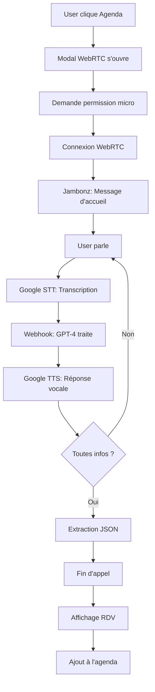

# 📞 IVR Agenda - Système de prise de rendez-vous téléphonique intelligent

> Prise de rendez-vous par téléphone avec IA conversationnelle GPT-4 et reconnaissance vocale

---

## 🎯 Vue d'ensemble

Ce système permet aux utilisateurs de prendre des rendez-vous médicaux par téléphone via un assistant vocal intelligent. L'IA conversationnelle (GPT-4) pose des questions naturelles, comprend les réponses en français, et extrait automatiquement les informations nécessaires (nom, date, docteur).

### Démo du flux

```
1. User clique "Agenda" 📅
2. Modal WebRTC s'ouvre ☎️
3. "Bienvenue sur services CLAUDIO" 🤖
4. "Je veux un rendez-vous" 👤
5. "Quel est votre nom ?" 🤖
6. "Jean Dupont" 👤
7. "Pour quelle date ?" 🤖
8. "Le 15 mars" 👤
9. "Avec quel docteur ?" 🤖
10. "Docteur Martin" 👤
11. Confirmation et fin d'appel ✅
12. RDV automatiquement ajouté à l'agenda 📊
```

---

## 📚 Documentation

### Guide de démarrage rapide
**👉 [QUICKSTART_IVR.md](QUICKSTART_IVR.md)** - Commencez ici ! (5 minutes)
- Installation en 4 étapes
- Configuration minimale
- Premier test

### Documentation complète
**📖 [IVR_SETUP.md](IVR_SETUP.md)** - Documentation technique détaillée
- Architecture du système
- Configuration avancée
- Customisation (voix, messages, prompts)
- API endpoints
- Debugging

### Résumé technique
**📋 [IVR_SUMMARY.md](IVR_SUMMARY.md)** - Vue d'ensemble technique
- Fonctionnalités implémentées
- Architecture détaillée
- Flux de données
- Structure des fichiers
- Métriques et KPIs

### Diagramme de séquence
**🔄 [IVR_SEQUENCE_DIAGRAM.md](IVR_SEQUENCE_DIAGRAM.md)** - Flux détaillé
- Diagramme de séquence complet
- Temps estimés par étape
- Coûts par appel
- Points critiques et optimisations

### Checklist de déploiement
**✅ [IVR_DEPLOYMENT_CHECKLIST.md](IVR_DEPLOYMENT_CHECKLIST.md)** - Guide de déploiement
- Pré-déploiement
- Configuration Vercel
- Configuration Jambonz
- Tests et validation
- Monitoring

---

## 🚀 Quick Start (TL;DR)

```bash
# 1. Configurer les variables d'environnement
echo "OPENAI_API_KEY=sk-proj-..." >> .env
echo "WEBHOOK_URL=https://your-app.vercel.app" >> .env

# 2. Déployer sur Vercel
npm run build
vercel --prod

# 3. Configurer Jambonz
node scripts/setup-jambonz-ivr.js

# 4. Tester !
# Ouvrir l'app → Cliquer "Agenda" → Parler
```

---

## 🏗️ Architecture en bref

```
Frontend (React + WebRTC)
    ↓
Backend API (Vercel Serverless)
    ↓
Jambonz (FreeSWITCH + Drachtio)
    ↓
Google Cloud (TTS/STT)
    ↓
OpenAI GPT-4 (IA conversationnelle)
    ↓
JSON structuré → Agenda
```

---

## 📁 Fichiers du système IVR

### Code Frontend
```
client/src/
└── components/
    └── AgendaCallModal.tsx          ← Modal WebRTC avec interface d'appel
```

### Code Backend
```
api/ivr/
├── start-call.ts                    ← Initialisation de l'appel WebRTC
├── appointment-webhook.ts           ← Webhook principal avec IA GPT-4 ⭐
└── last-appointment.ts              ← Récupération du dernier RDV
```

### Scripts
```
scripts/
└── setup-jambonz-ivr.js            ← Configuration automatique de Jambonz
```

### Documentation
```
docs/
├── IVR_README.md                    ← Ce fichier
├── QUICKSTART_IVR.md                ← Guide rapide (5 min)
├── IVR_SETUP.md                     ← Documentation complète
├── IVR_SUMMARY.md                   ← Résumé technique
├── IVR_SEQUENCE_DIAGRAM.md          ← Diagramme de flux
└── IVR_DEPLOYMENT_CHECKLIST.md      ← Checklist déploiement
```

---

## 🛠️ Technologies

| Composant | Technologie | Version |
|-----------|-------------|---------|
| Frontend | React + TypeScript | 18.3.1 |
| Communication | WebRTC | Native |
| Backend | Vercel Serverless | - |
| IVR Server | Jambonz | Latest |
| SIP Server | Drachtio | Via Jambonz |
| Media Server | FreeSWITCH | Via Jambonz |
| TTS | Google Cloud Text-to-Speech | fr-FR |
| STT | Google Cloud Speech-to-Text | fr-FR |
| IA | OpenAI GPT-4 Turbo | gpt-4-turbo-preview |
| UI Components | Shadcn UI | Latest |
| Icons | Lucide React | Latest |

---

## 💰 Coûts estimés

| Service | Usage par appel | Coût |
|---------|----------------|------|
| Google TTS | ~50 caractères | $0.0008 |
| Google STT | ~30 secondes | $0.0045 |
| GPT-4 Turbo | ~2000 tokens | $0.04 |
| **TOTAL** | **~1-2 minutes** | **~$0.045** |

💡 **100 appels/jour = $4.50/jour = $135/mois**

---

## 📊 Performance

| Métrique | Valeur cible |
|----------|--------------|
| Durée moyenne d'appel | 1-2 minutes |
| Taux de compréhension | > 90% |
| Taux de complétion | > 85% |
| Précision d'extraction | > 95% |
| Latence GPT-4 | ~800ms |
| Latence TTS/STT | ~300ms |

---

## 🎨 Interface utilisateur

### Bouton dans E05_VisitFlow
```tsx
<Button onClick={() => setShowAgendaModal(true)}>
  <Calendar className="w-5 h-5 mr-2" />
  Agenda
</Button>
```

### Modal états
1. **Idle** : Bouton vert "Démarrer l'appel"
2. **Connecting** : Loader avec "Connexion en cours..."
3. **Connected** : Indicateur d'appel actif + bouton rouge "Raccrocher"
4. **Ended** : Affichage du RDV extrait + bouton "Fermer"

---

## 🔑 Variables d'environnement

```bash
# .env
OPENAI_API_KEY=sk-proj-xxxxxxxxxxxxx  # Obligatoire
WEBHOOK_URL=https://your-app.vercel.app  # Obligatoire
```

---

## 🧪 Tests

### Test manuel du webhook

```bash
curl -X POST https://your-app.vercel.app/api/ivr/appointment-webhook \
  -H "Content-Type: application/json" \
  -d '{
    "call_sid": "test-123",
    "speech": "je veux un rendez-vous le 15 mars avec le docteur Martin pour Jean Dupont",
    "call_status": "in-progress"
  }'
```

### Test de récupération du RDV

```bash
curl https://your-app.vercel.app/api/ivr/last-appointment
```

---

## 🐛 Troubleshooting rapide

| Problème | Solution |
|----------|----------|
| Bouton "Agenda" absent | Vérifier que vous êtes sur E05_VisitFlow, rebuild |
| Micro non autorisé | Autoriser les permissions dans le navigateur |
| Appel ne se connecte pas | Vérifier HTTPS, vérifier WEBHOOK_URL |
| GPT-4 ne comprend pas | Vérifier OPENAI_API_KEY, crédits OpenAI |
| RDV non extrait | Vérifier les logs Vercel, tester manuellement |

---

## 🔄 Workflow complet



---

## 📞 Support et ressources

### Documentation externe
- [Jambonz Docs](https://docs.jambonz.org/) - Documentation officielle Jambonz
- [Jambonz API](https://api.jambonz.org/) - Référence API REST
- [Jambonz Verbs](https://docs.jambonz.org/webhooks/overview/) - Webhooks et verbs
- [OpenAI API](https://platform.openai.com/docs) - Documentation OpenAI
- [WebRTC Guide](https://webrtc.org/) - Guide WebRTC

### En cas de problème
1. Consulter [IVR_SETUP.md](IVR_SETUP.md) section Troubleshooting
2. Vérifier les logs Vercel : `vercel logs --follow`
3. Vérifier les logs Jambonz : `docker compose logs -f jambonz-feature-server`
4. Tester les endpoints manuellement

---

## 🚧 Limitations actuelles

1. **WebRTC** : Le endpoint `/api/ivr/start-call` utilise un SDP simulé
   - Pour production : implémenter connexion native via Jambonz WebRTC gateway

2. **Storage** : Les conversations sont en mémoire (ne fonctionne pas sur Vercel serverless)
   - Pour production : utiliser Redis (Upstash) ou Vercel KV

3. **Concurrence** : Un seul appel à la fois
   - Pour production : système de sessions par call_sid

4. **Timeout** : 10 secondes sans réponse = fin d'appel
   - Configurable dans le verb `listen`

---

## 🎯 Roadmap

### Phase 1 : MVP (✅ Complété)
- [x] Interface bouton Agenda
- [x] Modal WebRTC
- [x] Webhook IVR avec GPT-4
- [x] Extraction automatique nom/date/docteur
- [x] Documentation complète

### Phase 2 : Production (🔄 En cours)
- [ ] WebRTC natif avec Jambonz
- [ ] Stockage persistant (Redis/Vercel KV)
- [ ] Gestion multi-appels
- [ ] Tests unitaires et E2E

### Phase 3 : Améliorations (📅 Futur)
- [ ] Confirmation par SMS/Email
- [ ] Intégration Google Calendar
- [ ] Dashboard analytics
- [ ] Multi-langue (en, es)
- [ ] Voice biometrics

### Phase 4 : Scale (💡 Idées)
- [ ] Fine-tuning GPT-4 sur vos données
- [ ] Multi-tenant (plusieurs cabinets)
- [ ] API publique pour intégrations
- [ ] Mobile app (React Native)

---

## 👥 Contributeurs

- **Développement initial** : Claude (Anthropic)
- **Date de création** : 2026-01-05
- **Version** : 1.0.0

---

## 📄 Licence

Ce code est propriétaire et fait partie du projet Synergia.

---

## ⭐ Prochaines étapes recommandées

1. **Lire** [QUICKSTART_IVR.md](QUICKSTART_IVR.md) (5 minutes)
2. **Configurer** les variables d'environnement
3. **Déployer** sur Vercel
4. **Tester** le flux complet
5. **Personnaliser** les prompts GPT-4 selon vos besoins

---

**Bon développement ! 🚀**

*Pour toute question, consultez d'abord la documentation complète dans [IVR_SETUP.md](IVR_SETUP.md)*
